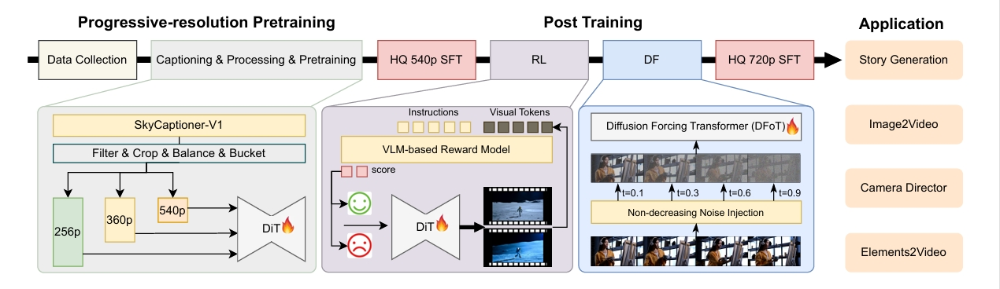

<p align="center">
  
</p>

# SkyReels V2: Infinite-Length Film Generative Model

<p align="center">
🤗 <a href="https://huggingface.co/collections/Skywork/skyreels-v2-6801b1b93df627d441d0d0d9" target="_blank">Hugging Face</a> · 👋 <a href="https://www.skyreels.ai/home?utm_campaign=github_V2" target="_blank">Playground</a> · 💬 <a href="https://discord.gg/PwM6NYtccQ" target="_blank">Discord</a> · 📑 <a href="https://arxiv.org/pdf/2504.13074">Technical Report</a>
</p>

---
Welcome to the SkyReels V2 repository! Here, you'll find the model weights and inference code for our infinite-lenght film genetative models


## 🔥🔥🔥 News!!

* Apr 21, 2025: 👋 We release the inference code and model weights of [SkyReels-V2](https://huggingface.co/SkyworkAI/SkyReels-V2) Series Models.
* Apr 3, 2025: 🔥 We also release [SkyReels-A2](https://github.com/SkyworkAI/SkyReels-A2). This is an open-sourced and effective framework portrait image animation model.


## 🎥 Demos
<div align="center">
<video src="https://github.com/user-attachments/docs/assets/2dbd116a-033d-4f7e-bd90-78a3da47cd9c" width="70%"> </video>
</div>


## 📑 TODO List

- [x] Technique Report
- [x] Checkpoints of the 14B and 1.3B Models Series
- [x] Single-GPU & Multi-GPU Inference Code
- [x] SkyCaptioner V1 Video Annotation Model
- [x] Prompt Rewrite
- [ ] Diffusers integration
- [ ] Checkpoints of the 5B Models Series
- [ ] Checkpoints of the Camera Director Models
- [ ] Checkpoints of the Step & Guidance Distill Model


## 🚀 Quickstart

#### Installation
```shell
# clone the repository.
git clone https://github.com/SkyworkAI/Skyreels-V2
cd Skyreels-V2
# Install dependencies. Test environment uses Python 3.10.12.
pip install -r requirements.txt
```

#### Model Download
You can download our models from Hugging Face:
<table>
  <thead>
    <tr>
      <th>Type</th>
      <th>Model Size</th>
      <th>Resolution</th>
      <th>Height/Width/Frame</th>
      <th>Link</th>
    </tr>
  </thead>
  <tbody>
    <tr>
      <td rowspan="5">Diffusion Forcing</td>
      <td>1.3B</td>
      <td>540P</td>
      <td>544 * 960 * 97f</td>
      <td>🤗 <a href="https://huggingface.co/SkyworkAI/SkyReels-V2-DF-1.3B">Huggingface</a> 🤖 <a href="https://www.modelscope.cn/SkyworkAI/SkyReels-V2-DF-1.3B">ModelScope</a></td>
    </tr>
    <tr>
      <td rowspan="2">5B</td>
      <td>540P</td>
      <td>544 * 960 * 97f</td>
      <td>Coming Soon</td>
    </tr>
    <tr>
      <td>720P</td>
      <td>720 * 1280 * 121f</td>
      <td>Coming Soon</td>
    </tr>
    <tr>
      <td rowspan="2">14B</td>
      <td>540P</td>
      <td>544 * 960 * 97f</td>
      <td>🤗 <a href="https://huggingface.co/SkyworkAI/SkyReels-V2-DF-14B-540P">Huggingface</a> 🤖 <a href="https://www.modelscope.cn/SkyworkAI/SkyReels-V2-DF-14B-540P">ModelScope</a></td>
    </tr>
    <tr>
      <td>720P</td>
      <td>720 * 1280 * 121f</td>
      <td>🤗 <a href="https://huggingface.co/SkyworkAI/SkyReels-V2-DF-14B-720P">Huggingface</a> 🤖 <a href="https://www.modelscope.cn/SkyworkAI/SkyReels-V2-DF-14B-720P">ModelScope</a></td>
    </tr>
    <tr>
      <td rowspan="5">Text-to-Video</td>
      <td>1.3B</td>
      <td>540P</td>
      <td>544 * 960 * 97f</td>
      <td>🤗 <a href="https://huggingface.co/SkyworkAI/SkyReels-V2-T2V-1.3B">Huggingface</a> 🤖 <a href="https://www.modelscope.cn/SkyworkAI/SkyReels-V2-T2V-1.3B">ModelScope</a></td>
    </tr>
    <tr>
      <td rowspan="2">5B</td>
      <td>540P</td>
      <td>544 * 960 * 97f</td>
      <td>Coming Soon</td>
    </tr>
    <tr>
      <td>720P</td>
      <td>720 * 1280 * 121f</td>
      <td>Coming Soon</td>
    </tr>
    <tr>
      <td rowspan="2">14B</td>
      <td>540P</td>
      <td>544 * 960 * 97f</td>
      <td>🤗 <a href="https://huggingface.co/SkyworkAI/SkyReels-V2-T2V-14B-540P">Huggingface</a> 🤖 <a href="https://www.modelscope.cn/SkyworkAI/SkyReels-V2-T2V-14B-540P">ModelScope</a></td>
    </tr>
    <tr>
      <td>720P</td>
      <td>720 * 1280 * 121f</td>
      <td>🤗 <a href="https://huggingface.co/SkyworkAI/SkyReels-V2-T2V-14B-720P">Huggingface</a> 🤖 <a href="https://www.modelscope.cn/SkyworkAI/SkyReels-V2-T2V-14B-720P">ModelScope</a></td>
    </tr>
    <tr>
      <td rowspan="5">Image-to-Video</td>
      <td>1.3B</td>
      <td>540P</td>
      <td>544 * 960 * 97f</td>
      <td>🤗 <a href="https://huggingface.co/SkyworkAI/SkyReels-V2-I2V-1.3B">Huggingface</a> 🤖 <a href="https://www.modelscope.cn/SkyworkAI/SkyReels-V2-I2V-1.3B">ModelScope</a></td>
    </tr>
    <tr>
      <td rowspan="2">5B</td>
      <td>540P</td>
      <td>544 * 960 * 97f</td>
      <td>Coming Soon</td>
    </tr>
    <tr>
      <td>720P</td>
      <td>720 * 1280 * 121f</td>
      <td>Coming Soon</td>
    </tr>
    <tr>
      <td rowspan="2">14B</td>
      <td>540P</td>
      <td>544 * 960 * 97f</td>
      <td>🤗 <a href="https://huggingface.co/SkyworkAI/SkyReels-V2-I2V-14B-540P">Huggingface</a> 🤖 <a href="https://www.modelscope.cn/SkyworkAI/SkyReels-V2-I2V-14B-540P">ModelScope</a></td>
    </tr>
    <tr>
      <td>720P</td>
      <td>720 * 1280 * 121f</td>
      <td>🤗 <a href="https://huggingface.co/SkyworkAI/SkyReels-V2-I2V-14B-720P">Huggingface</a> 🤖 <a href="https://www.modelscope.cn/SkyworkAI/SkyReels-V2-I2V-14B-720P">ModelScope</a></td>
    </tr>
    <tr>
      <td rowspan="3">Camera Director</td>
      <td rowspan="2">5B</td>
      <td>540P</td>
      <td>544 * 960 * 97f</td>
      <td>Coming Soon</td>
    </tr>
    <tr>
      <td>720P</td>
      <td>720 * 1280 * 121f</td>
      <td>Coming Soon</td>
    </tr>
    <tr>
      <td>14B</td>
      <td>720P</td>
      <td>720 * 1280 * 121f</td>
      <td>Coming Soon</td>
    </tr>
  </tbody>
</table>

After downloading, set the model path in your generation commands:


#### Single GPU Inference

- **Diffusion Forcing**

In diffusion forcing, we support both synchronous and asynchronous inference modes. Additionally, we support generating long videos from specified images.
```shell
model_id=Skywork/SkyReels-V2-DF-14B-540P
# synchronous inference
python3 generate_video_df.py \
  --model_id ${model_id} \
  --height 544 \
  --width 960 \
  --ar_step 0 \
  --base_num_frames 97 \
  --num_frames 257 \
  --overlap_history 17 \
  --prompt "A serene lake surrounded by towering mountains, with a few swans gracefully gliding across the water and sunlight dancing on the surface." \
  --offload
```
> **Note**: You can use `--ar_step 5` to enable asynchronous inference. When asynchronous inference, `--causal_block_size 5` is recommanded. If you want to run the DF model for **image-to-video (I2V)** tasks, add `--image ${image_path}` to your command. `--addnoise_condition 20` is recommanded to add for better long video consistency.

- **Text To Video & Image To Video**

```shell
# run Text-to-Video Generation
model_id=Skywork/SkyReels-V2-T2V-14B-540P
python3 generate_video.py \
  --model_id ${model_id} \
  --height 544 \
  --width 960 \
  --num_frames 97 \
  --guidance_scale 6.0 \
  --shift 8.0 \
  --fps 24 \
  --prompt "A serene lake surrounded by towering mountains, with a few swans gracefully gliding across the water and sunlight dancing on the surface." \
  --offload
```
> **Note**: When using an **image-to-video (I2V)** model, you must provide an input image using the `--image  ${image_path}` parameter.

**More Configurations**
We list some useful configurations for easy usage:
| Argument | Recommended | Description |
|:----------------------:|:---------:|:-----------------------------------------:|
| --prompt |  | Text prompt for video generation |
| --image |  | Input image Path for video generation |
| --resolution | 540P or 720P | Resolution of the generated video (depends on model type) |
| --num_frames | 97 or 121 | Number of frames in the generated video (**97 for 540P**, **121 for 720P**) |
| --inference_steps | 50 | Number of sampling steps |
| --fps | 24 | Frame rate of the generated video |
| --shift | 8.0 or 5.0 | Shift factor for flow matching schedulers (Recommended: **8.0 for T2V models**, **5.0 for I2V models**) |
| --guidance_scale | 6.0 or 5.0| Classifier-free guidance scale (Recommended: **6.0 for T2V models**, **5.0 for for I2V models**) |
| --seed |  | Random seed for video generation (if None, a random seed will be initialized) |
| --offload | True | Enable CPU offload for model transformer and t5 loading to save memory (necessary for high-resolution video generation) |
| --use_usp | True | Enable multi-GPU inference using xDiT USP |
| --outdir | ./video_out | Directory path to save the generated video |
| Diffusion Forcing Additional Parameters  |
| --ar_step | 0 | Step size for asynchronous inference |
| --base_num_frames | 97 or 121 | Number of base frames in the generated video (**97 for 540P**, **121 for 720P**) |
| --overlap_history | 17 | Number of overlapping frames for continuity |
| --addnoise_condition | 0 | Control noise added to conditioning frames |

#### Multi-GPU inference using xDiT USP

We use [xDiT](https://github.com/xdit-project/xDiT) USP to accelerate inference.  For example, to generate a video with 2 GPUs, you can use the following command:
```shell
model_id=Skywork/SkyReels-V2-DF-14B-540P
# diffusion forcing synchronous inference
torchrun \
  --nproc_per_node=2 \
  generate_video_df.py \
  --model_id ${model_id} \
  --height 544 \
  --width 960 \
  --ar_step 0 \
  --base_num_frames 97 \
  --num_frames 257 \
  --overlap_history 17 \
  --prompt "A serene lake surrounded by towering mountains, with a few swans gracefully gliding across the water and sunlight dancing on the surface." \
  --use_usp \
  --offload \
  --seed 42
```

```shell
# run Text-to-Video Generation
model_id=Skywork/SkyReels-V2-T2V-14B-540P
torchrun --nproc_per_node=2 generate_video.py \
  --model_id ${model_id} \
  --height 544 \
  --width 960 \
  --num_frames 97 \
  --guidance_scale 6.0 \
  --shift 8.0 \
  --fps 24 \
  --offload \
  --prompt "A serene lake surrounded by towering mountains, with a few swans gracefully gliding across the water and sunlight dancing on the surface." \
  --use_usp \
  --seed 42
```

## Contents
  - [Abstract](#abstract)
  - [Methodology Overview of SkyReels-V2](#methodology-overview-of-skyreels-v2)
  - [Key Contributions of SkyReels-V2](#key-contributions-of-skyreels-v2)
    - [Skyreels Captioner](#skyreels-captioner)
    - [Reinforcement Learning](#reinforcement-learning)
    - [Diffusion Forcing](#diffusion-forcing)
    - [Hight-Quality Supervised Fine-Tuning(SFT)](#hight-quality-supervised-fine-tuningsft)
  - [Performance](#performance)
  - [Acknowledgements](#acknowledgements)
  - [Citation](#citation)
---

## Abstract
Recent advances in video generation have been driven by diffusion models and autoregressive frameworks, yet critical challenges persist in harmonizing prompt adherence, visual quality, motion dynamics, and duration: compromises in motion dynamics to enhance temporal visual quality, constrained video duration (5-10 seconds) to prioritize resolution, and inadequate shot-aware generation stemming from general-purpose MLLMs' inability to interpret cinematic grammar, such as shot composition, actor expressions, and camera motions. These intertwined limitations hinder realistic long-form synthesis and professional film-style generation. 

To address these limitations, we introduce SkyReels-V2, the world's first infinite-length film generative model using a Diffusion Forcing framework. Our approach synergizes Multi-modal Large Language Models (MLLM), Multi-stage Pretraining, Reinforcement Learning, and Diffusion Forcing techniques to achieve comprehensive optimization. Beyond its technical innovations, SkyReels-V2 enables multiple practical applications, including Story Generation, Image-to-Video Synthesis, Camera Director functionality, and multi-subject consistent video generation through our Skyreels-A2 system.

## Methodology Overview of SkyReels-V2

The SkyReels-V2 methodology consists of several interconnected components. It starts with a comprehensive data processing pipeline that prepares high-quality training data. At its core is the Video Captioner architecture, which provides detailed annotations for video content. The system employs a multi-task pretraining strategy to build fundamental video generation capabilities. Post-training optimization includes Reinforcement Learning to enhance motion quality, Diffusion Forcing Training for generating extended videos, and High-quality Supervised Fine-Tuning (SFT) stages for visual refinement. The model runs on optimized computational infrastructure for efficient training and inference. SkyReels-V2 supports multiple applications, including Story Generation, Image-to-Video Synthesis, Camera Director functionality, and Elements-to-Video Generation.

<p align="center">
  
</p>

## Key Contributions of SkyReels-V2

#### Skyreels Captioner

SkyCaptioner-V1 serves as our video captioning model for data annotation. This model is trained on the captioning result from the base model Qwen2.5-VL-32B and the sub-expert captioners on a balanced video data. The balanced video data is a carefully curated dataset of approximately 2 million videos—selected from an initial pool of 10 million samples to ensure conceptual balance and annotation quality. Built upon the Qwen2.5-VL-7B-Instruction foundation model, SkyCaptioner-V1 is fine-tuned to enhance performance in domain-specific video captioning tasks. To compare the performance with the SOTA models, we conducted a manual assessment of accuracy across different captioning fields using a test set of 1,000 samples. The proposed SkyCaptioner-V1 achieves the highest average accuracy among the baseline models, and show a dramatic result in the shot related fields

<p align="center">
<table align="center">
  <thead>
    <tr>
      <th>model</th>
      <th>Qwen2.5-VL-7B-Ins.</th>
      <th>Qwen2.5-VL-72B-Ins.</th>
      <th>Tarsier2-recap-7B</th>
      <th>SkyCaptioner-V1</th>
    </tr>
  </thead>
  <tbody>
    <tr>
      <td>Avg accuracy</td>
      <td>51.4%</td>
      <td>58.7%</td>
      <td>49.4%</td>
      <td><strong>76.3%</strong></td>
    </tr>
    <tr>
      <td>shot type</td>
      <td>76.8%</td>
      <td>82.5%</td>
      <td>60.2%</td>
      <td><strong>93.7%</strong></td>
    </tr>
    <tr>
      <td>shot angle</td>
      <td>60.0%</td>
      <td>73.7%</td>
      <td>52.4%</td>
      <td><strong>89.8%</strong></td>
    </tr>
    <tr>
      <td>shot position</td>
      <td>28.4%</td>
      <td>32.7%</td>
      <td>23.6%</td>
      <td><strong>83.1%</strong></td>
    </tr>
    <tr>
      <td>camera motion</td>
      <td>62.0%</td>
      <td>61.2%</td>
      <td>45.3%</td>
      <td><strong>85.3%</strong></td>
    </tr>
    <tr>
      <td>expression</td>
      <td>43.6%</td>
      <td>51.5%</td>
      <td>54.3%</td>
      <td><strong>68.8%</strong></td>
    </tr>
    <tr>
      <td colspan="5" style="text-align: center; border-bottom: 1px solid #ddd; padding: 8px;"></td>
    </tr>
    <tr>
      <td>TYPES_type</td>
      <td>43.5%</td>
      <td>49.7%</td>
      <td>47.6%</td>
      <td><strong>82.5%</strong></td>
    </tr>
    <tr>
      <td>TYPES_sub_type</td>
      <td>38.9%</td>
      <td>44.9%</td>
      <td>45.9%</td>
      <td><strong>75.4%</strong></td>
    </tr>
    <tr>
      <td>appearance</td>
      <td>40.9%</td>
      <td>52.0%</td>
      <td>45.6%</td>
      <td><strong>59.3%</strong></td>
    </tr>
    <tr>
      <td>action</td>
      <td>32.4%</td>
      <td>52.0%</td>
      <td><strong>69.8%</strong></td>
      <td>68.8%</td>
    </tr>
    <tr>
      <td>position</td>
      <td>35.4%</td>
      <td>48.6%</td>
      <td>45.5%</td>
      <td><strong>57.5%</strong></td>
    </tr>
    <tr>
      <td>is_main_subject</td>
      <td>58.5%</td>
      <td>68.7%</td>
      <td>69.7%</td>
      <td><strong>80.9%</strong></td>
    </tr>
    <tr>
      <td>environment</td>
      <td>70.4%</td>
      <td><strong>72.7%</strong></td>
      <td>61.4%</td>
      <td>70.5%</td>
    </tr>
    <tr>
      <td>lighting</td>
      <td>77.1%</td>
      <td><strong>80.0%</strong></td>
      <td>21.2%</td>
      <td>76.5%</td>
    </tr>
  </tbody>
</table>
</p>

#### Reinforcement Learning
Inspired by the previous success in LLM, we propose to enhance the performance of the generative model by Reinforcement Learning. Specifically, we focus on the motion quality because we find that the main drawback of our generative model is:

- the generative model does not handle well with large, deformable motions. 
- the generated videos may violate the physical law.

To avoid the degradation in other metrics, such as text alignment and video quality, we ensure the preference data pairshave comparable text alignment and video quality, while only the motion quality varies. This requirement poses greaterchallenges in obtaining preference annotations due to the inherently higher costs of human annotation. To addressthis challenge, we propose a semi-automatic pipeline that strategically combines automatically generated motion pairsand human annotation results. This hybrid approach not only enhances the data scale but also improves alignmentwith human preferences through curated quality control. Leveraging this enhanced dataset, we first train a specializedreward model to capture the generic motion quality differences between paired samples. This learned reward functionsubsequently guides the sample selection process for Direct Preference Optimization (DPO), enhancing the motionquality of the generative model.

#### Diffusion Forcing

We introduce the Diffusion Forcing Transformer to unlock our model’s ability to generate long videos. Diffusion Forcing is a training and sampling strategy where each token is assigned an independent noise level. This allows tokens to be denoised according to arbitrary, per-token schedules. Conceptually, this approach functions as a form of partial masking: a token with zero noise is fully unmasked, while complete noise fully masks it. Diffusion Forcing trains the model to "unmask" any combination of variably noised tokens, using the cleaner tokens as conditional information to guide the recovery of noisy ones. Building on this, our Diffusion Forcing Transformer can extend video generation indefinitely based on the last frames of the previous segment. Note that the synchronous full sequence diffusion is a special case of Diffusion Forcing, where all tokens share the same noise level. This relationship allows us to fine-tune the Diffusion Forcing Transformer from a full-sequence diffusion model.

#### Hight-Quality Supervised Fine-Tuning(SFT)

We implement two sequential high-quality supervised fine-tuning (SFT) stages at 540p and 720p resolutions respectively,with the initial SFT phase conducted immediately after pretraining but prior to reinforcement learning (RL) stage.This first-stage SFT serves as a conceptual equilibrium trainer, building upon the foundation model’s pretraining outcomes that utilized only fps24 video data, while strategically removing FPS embedding components to streamline thearchitecture. Trained with the high-quality concept-balanced samples, this phase establishesoptimized initialization parameters for subsequent training processes. Following this, we execute a secondary high-resolution SFT at 720p after completing the diffusion forcing stage, incorporating identical loss formulations and thehigher-quality concept-balanced datasets by the manually filter. This final refinement phase focuses on resolution increase such that the overall video quality will be further enhanced.

## Performance

To comprehensively evaluate our proposed method, we construct the SkyReels-Bench for human assessment and leveraged the open-source V-Bench for automated evaluation. This allows us to compare our full-sequence diffusion model, diffusion-forcing variant, and state-of-the-art (SOTA) baselines, including both open-source and proprietary models.

#### Human Evaluation

For human evaluation, we design SkyReels-Bench with 1,020 text prompts, systematically assessing three dimensions: Instruction Adherence, Motion Quality, Consistency and Visual Quality. This benchmark is designed to evaluate both text-to-video (T2V) and image-to-video (I2V) generation models, providing comprehensive assessment across different
generation paradigms.

- Text To Video Models

<p align="center">
<table align="center">
  <thead>
    <tr>
      <th>Model Name</th>
      <th>Average</th>
      <th>Instruction Adherence</th>
      <th>Consistency</th>
      <th>Visual Quality</th>
      <th>Motion Quality</th>
    </tr>
  </thead>
  <tbody>
    <tr>
      <td>Runway-Gen3 Alpha</td>
      <td>2.53</td>
      <td>2.19</td>
      <td>2.57</td>
      <td>3.23</td>
      <td>2.11</td>
    </tr>
    <tr>
      <td>HunyuanVideo-13B</td>
      <td>2.82</td>
      <td>2.64</td>
      <td>2.81</td>
      <td>3.20</td>
      <td>2.61</td>
    </tr>
    <tr>
      <td>Kling-1.6 STD Mode</td>
      <td>2.99</td>
      <td>2.77</td>
      <td>3.05</td>
      <td>3.39</td>
      <td><strong>2.76</strong></td>
    </tr>
    <tr>
      <td>Hailuo-01</td>
      <td>3.0</td>
      <td>2.8</td>
      <td>3.08</td>
      <td>3.29</td>
      <td>2.74</td>
    </tr>
    <tr>
      <td>Wan2.1-14B</td>
      <td>3.12</td>
      <td>2.91</td>
      <td>3.31</td>
      <td><strong>3.54</strong></td>
      <td>2.71</td>
    </tr>
    <tr>
      <td>SkyReels-V2</td>
      <td><strong>3.14</strong></td>
      <td><strong>3.15</strong></td>
      <td><strong>3.35</strong></td>
      <td>3.34</td>
      <td>2.74</td>
    </tr>
  </tbody>
</table>
</p>

The evaluation demonstrates that our model achieves significant advancements in instruction adherence compared to baseline methods, while maintaining competitive performance in motion
without sacrificing the consistency. To ensure fairness, all models were evaluated under default settings with consistent resolutions, and no post-generation filtering was applied.

- Image To Video Models

<p align="center">
<table align="center">
  <thead>
    <tr>
      <th>Model</th>
      <th>Average</th>
      <th>Instruction Adherence</th>
      <th>Consistency</th>
      <th>Visual Quality</th>
      <th>Motion Quality</th>
    </tr>
  </thead>
  <tbody>
    <tr>
      <td>HunyuanVideo-13B</td>
      <td>2.84</td>
      <td>2.97</td>
      <td>2.95</td>
      <td>2.87</td>
      <td>2.56</td>
    </tr>
    <tr>
      <td>Wan2.1-14B</td>
      <td>2.85</td>
      <td>3.10</td>
      <td>2.81</td>
      <td>3.00</td>
      <td>2.48</td>
    </tr>
    <tr>
      <td>Hailuo-01</td>
      <td>3.05</td>
      <td>3.31</td>
      <td>2.58</td>
      <td>3.55</td>
      <td>2.74</td>
    </tr>
    <tr>
      <td>Kling-1.6 Pro Mode</td>
      <td>3.4</td>
      <td>3.56</td>
      <td>3.03</td>
      <td>3.58</td>
      <td>3.41</td>
    </tr>
    <tr>
      <td>Runway-Gen4</td>
      <td>3.39</td>
      <td>3.75</td>
      <td>3.2</td>
      <td>3.4</td>
      <td>3.37</td>
    </tr>
    <tr>
      <td>SkyReels-V2-DF</td>
      <td>3.24</td>
      <td>3.64</td>
      <td>3.21</td>
      <td>3.18</td>
      <td>2.93</td>
    </tr>
    <tr>
      <td>SkyReels-V2-I2V</td>
      <td>3.29</td>
      <td>3.42</td>
      <td>3.18</td>
      <td>3.56</td>
      <td>3.01</td>
    </tr>
  </tbody>
</table>
</p>

Our results demonstrate that both SkyReels-V2-I2V (3.29) and SkyReels-V2-DF (3.24) achieve state-of-the-art performance among open-source models, significantly outperforming HunyuanVideo-13B (2.84) and Wan2.1-14B (2.85) across all quality dimensions. With an average score of 3.29, SkyReels-V2-I2V demonstrates comparable performance to proprietary models Kling-1.6 (3.4) and Runway-Gen4 (3.39).


#### VBench
To objectively compare SkyReels-V2 T2V Model against other leading open-source Text-To-Video models, we conduct comprehensive evaluations using the public benchmark VBench. Our evaluation specifically leverages the benchmark’s longer version prompt. For fair comparison with baseline models, we strictly follow their recommended setting for inference. 

<p align="center">
<table align="center">
  <thead>
    <tr>
      <th>Model</th>
      <th>Total Score</th>
      <th>Quality Score</th>
      <th>Semantic Score</th>
    </tr>
  </thead>
  <tbody>
    <tr>
      <td>OpenSora 2.0</td>
      <td>81.5 %</td>
      <td>82.1 %</td>
      <td>78.2 %</td>
    </tr>
    <tr>
      <td>CogVideoX1.5-5B</td>
      <td>80.3 %</td>
      <td>80.9 %</td>
      <td>77.9 %</td>
    </tr>
    <tr>
      <td>HunyuanVideo-13B</td>
      <td>82.7 %</td>
      <td>84.4 %</td>
      <td>76.2 %</td>
    </tr>
    <tr>
      <td>Wan2.1-14B</td>
      <td>83.7 %</td>
      <td>84.2 %</td>
      <td><strong>81.4 %</strong></td>
    </tr>
    <tr>
      <td>SkyReels-V2</td>
      <td><strong>83.9 %</strong></td>
      <td><strong>84.7 %</strong></td>
      <td>80.8 %</td>
    </tr>
  </tbody>
</table>
</p>

The VBench results demonstrate that SkyReels-V2 outperforms all compared models including HunyuanVideo-13B and Wan2.1-14B, With the highest total score (83.9%) and quality score (84.7%). In this evaluation, the semantic score is slightly lower than Wan2.1-14B, while we outperform Wan2.1-14B in human evaluations, with the primary gap attributed to V-Bench’s insufficient evaluation of shot-scenario semantic adherence.

## Acknowledgements
We would like to thank the contributors of <a href="https://github.com/Wan-Video/Wan2.1">Wan2.1</a> and <a href="https://github.com/xdit-project/xDiT">XDiT</a> repositories, for their open research and contributions.

## Citation

```bibtex
@misc{chen2025skyreelsv2infinitelengthfilmgenerative,
      title={SkyReels-V2: Infinite-length Film Generative Model}, 
      author={Guibin Chen and Dixuan Lin and Jiangping Yang and Chunze Lin and Juncheng Zhu and Mingyuan Fan and Hao Zhang and Sheng Chen and Zheng Chen and Chengchen Ma and Weiming Xiong and Wei Wang and Nuo Pang and Kang Kang and Zhiheng Xu and Yuzhe Jin and Yupeng Liang and Yubing Song and Peng Zhao and Boyuan Xu and Di Qiu and Debang Li and Zhengcong Fei and Yang Li and Yahui Zhou},
      year={2025},
      eprint={2504.13074},
      archivePrefix={arXiv},
      primaryClass={cs.CV},
      url={https://arxiv.org/abs/2504.13074}, 
}
```
